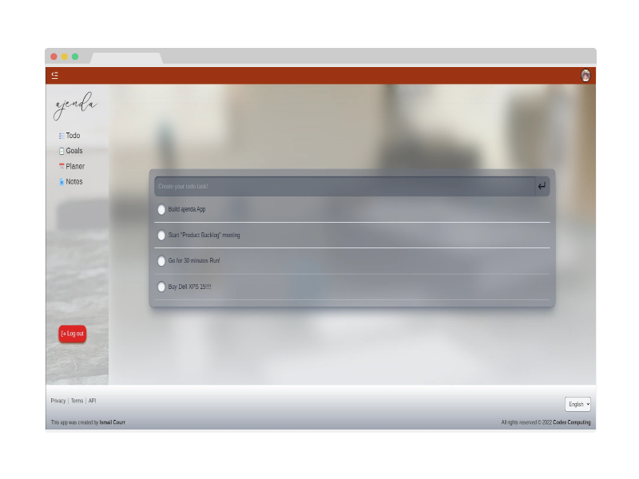

<h1>ajenda<h1>

<h2>Todo list & Task manager app<h2>

<i>ajenda is a Todo List & task manager tool to track your daily and weakly goals, Setup todo list and Track your progress over time.</i>

## Built With

- Javascript
- React
- Redux
- Ruby on Rails API

## Live Demo

[Live Demo Link](https://livedemo.com)

## Author

👤 **Ismail Courr**

- GitHub: [@ismailco](https://github.com/ismailco)
- Twitter: [@ismailcourr](https://twitter.com/ismailcourr)
- LinkedIn: [Ismail Courr](https://linkedin.com/in/ismailcourr)

## 🤝 Contributing

Contributions, issues, and feature requests are welcome!

Feel free to check the [issues page](../../issues/).

## Show your support

Give a ⭐️ if you like this project!

## Acknowledgments

- Hat tip to anyone whose code was used

## 📝 License

This project is [MIT](./LICENSE) licensed.
